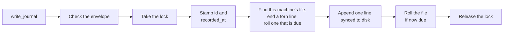

# The core module

The Python package in [`plugin/brain/`](../plugin/brain/) is the Brain's low-level interface to its data. It defines the shape of a record and the layout of the folders, and it holds the write path. Nothing else writes the files: an agent reaches them only through the MCP server, which calls this package. DuckDB, which reads them, cannot append to a JSONL file, and a DuckDB database allows only one process to write. The tests in [`tests/`](../tests/) drive it directly, with no server.

A Brain is an append-only log of events. It holds events, never current state; how things stand now is worked out by reading the events in order. A record is never edited, and a correction is a new entry.

| Module | Holds |
| --- | --- |
| [`format.py`](../plugin/brain/format.py) | The file format: the record's envelope and its checks, the one-line encoding, the folder layout, and file names. The read side imports it; it imports neither side. |
| [`write.py`](../plugin/brain/write.py) | `Writer.write_entry`, the one generic write. |
| [`entries.py`](../plugin/brain/entries.py) | One method per supported type, over `write_entry`. |
| [`lock.py`](../plugin/brain/lock.py) | The OS lock that makes sessions on one machine take turns. |

## Folders

```
<event store>/                 synced between machines
  events/
    h-0199a8c4-….jsonl         sealed: its machine has moved on
    h-0199f02e-….jsonl         open: its machine appends here

<state folder>/                this machine's own, never synced
  <key>.lock                   the lock file
  <key>.json                   the file this machine appends to, and its line count
```

The event store is one flat `events/` folder. Each file is named `h-<uuidv7>.jsonl` for the time it was started, and only the machine that created it ever appends to it. A sync service copies whole files between machines, so two machines appending to one file would each overwrite the other's lines; with one owner per file, that never happens, and no machine is named in the layout. The state folder is never synced: the lock coordinates only this machine, and the current file is this machine's alone. `<key>` is a hash of the event store's path, so two Brains on one machine never share a lock or a current file. The caller hands the `Writer` both folders; the MCP server supplies the state folder.

## A record

Each record is one line of UTF-8 JSON, ended by a newline, with one envelope shared by every type. What a type adds goes in `details`, never beside the envelope, so every record has the same shape whatever its type: the read side's columns are fixed, and nothing a type adds can clash with a field of the envelope.

```json
{"id":"0199a8c4-…","type":"journal","version":1,
 "recorded_at":"2026-09-28T23:14:32Z","event_date":"2026-09-14",
 "description":"Oil change","source":"voice",
 "body":"## Service\nOil and filter changed…","details":{}}
```

| Field | Carries |
| --- | --- |
| `id` | A UUIDv7, stamped by the write path. Unique everywhere without coordination; it carries no meaning a query relies on. |
| `type` | The kind of entry, such as `journal`. |
| `version` | The version of that type's shape the record was written under, fixed by the type's method. |
| `recorded_at` | When it was written down, UTC, stamped by the write path. For display; nothing orders by it. |
| `event_date` | When the event happened, a local date. What a reader orders by. |
| `description` | A one-line summary. |
| `body` | Markdown: the account itself. |
| `source` | How the information arrived, such as `voice` or `email`. The only optional field. |
| `details` | What the type adds, as a JSON object; `{}` when it adds nothing. |

A record carries no writer and no position: its `id` lets it stand alone wherever it is copied. The newline ends a record. A line that is whole and valid JSON is a record, and anything else is a fragment a reader skips.

## Writing

A caller writes through a type's method, such as `Entries.write_journal`, which takes only that type's fields, fixes its `type` and `version`, and calls `Writer.write_entry`. The MCP server exposes the type methods, never `write_entry`. `journal` is the only type so far.



- **Checks.** A blank or invalid envelope field, or `details` that is not a JSON object, raises `RecordError`, and nothing is written.
- **The lock.** An OS lock on the lock file in the state folder, never on a JSONL file: the holder may roll the file, and on Windows a lock on a file's bytes blocks everyone else from reading them. A session waits up to 30 seconds, then gets `LockTimeout`; the lock is held for milliseconds, so a longer wait means something has hung. The OS releases the lock when its process dies, so a crash leaves nothing behind.
- **This machine's file.** The state names the file and its line count. A file that is gone, or state that is missing or names another store, starts a new file; the machine never resumes a file it did not create.
- **A torn last line**, left by a crash mid-append, is ended with a newline before the next append. The fragment is never truncated: cutting bytes from a file the sync service may be copying can lose data.
- **Rolling.** A file rolls at 10,000 lines or 7 days old, by the time in its name. It is then sealed and never changes again, so a backup or a sync copies it once. The next append starts a new file. When a file rolls carries no meaning for a reader.
- **The append** is one unbuffered write, synced to disk before `write_entry` returns.
- **A blocked file.** An append that another process blocks, such as a sync service holding the file open, retries with backoff for up to 10 seconds under the lock, then raises `AppendBlocked`.

The Brain relies on the sync service to carry files between machines and does not coordinate them, so minor loss at the sync boundary is accepted.
