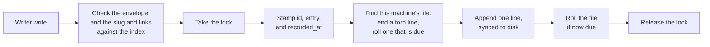
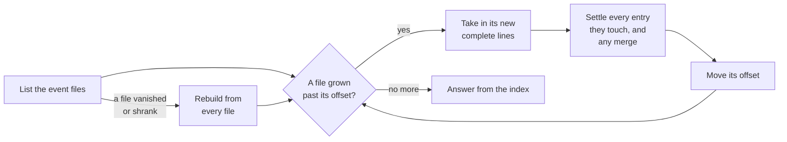

# The core module

The Python package in [`plugin/brain/`](../plugin/brain/) is the Brain's low-level interface to its data. It defines the shape of a record and the layout of the folders, and it holds the write path and the read path. Nothing else writes the files: an agent writes them only through [the MCP server](mcp-server.md), which calls this package, and a skill's own script, such as the document skill's, may read them through `Reader` directly. Reading goes through [a local index](#the-local-index) each machine builds from the files and keeps for itself. The tests in [`tests/`](../tests/) drive it directly, with no server.

A Brain is an append-only log of entries. It holds events, never current state; how things stand now is worked out by reading the entries in order. A record is never edited, and a correction is a new record.

The core module knows no type of entry. Every entry has the same shape, a name, and links to other entries, and what a type means, such as a journal entry, an entity, or a filed document, is defined by [the skill](skills.md) that writes it. So a new type needs no change here or to the server. Work a skill needs beyond writing and reading entries, such as filing a document's file, is done by the skill's own script.

| Module | Holds |
| --- | --- |
| [`format.py`](../plugin/brain/format.py) | The file format: the record's envelope and its checks, the one-line encoding, the folder layout, and file names. The read side imports it; it imports neither side. |
| [`write.py`](../plugin/brain/write.py) | `Writer.write`, the one write for every type: it creates an entry or revises one, checks it against what the index holds, stamps it, and appends it. |
| [`index.py`](../plugin/brain/index.py) | The local index: the SQLite database this machine keeps of the files, caught up before every read. |
| [`read.py`](../plugin/brain/read.py) | `Reader`, the one read for every type: search, and entries by id. It reads through the index, which imports the file format, and never imports the write path. |
| [`lock.py`](../plugin/brain/lock.py) | The OS lock that makes sessions on one machine take turns. |

## Folders

```
<Brain folder>/                synced between machines
  events/
    h-0199a8c4-….jsonl         sealed: its machine has moved on
    h-0199f02e-….jsonl         open: its machine appends here
  documents/                   the filed documents, kept by the document skill
    assets/blue-hatchback/service/2026-09-14-oil-change-invoice.pdf

<plugin data folder>/          this machine's own, never synced
  <key>.lock                   the lock file
  <key>.json                   the file this machine appends to, its line count, and its last id's time
  <key>.index.sqlite           the local index
```

The Brain folder's events are in one flat `events/` folder. Each file is named `h-<uuidv7>.jsonl` for the time it was started, and only the machine that created it ever appends to it. A machine has exactly one active file at a time: every session on it appends to that one, and when it [rolls](#writing) it is sealed and the next append starts the machine's next file. So a machine leaves a series of small files, never more than one of them open. A sync service copies whole files between machines, so two machines appending to one file would each overwrite the other's lines; with one owner per file, that never happens, and no machine is named in the layout. The plugin data folder is never synced: the lock coordinates only this machine, the current file is this machine's alone, and the index is built here from the files. `<key>` is a hash of the Brain folder's path, so two Brains on one machine never share a lock, a current file, or an index. The caller hands the `Writer` and the `Reader` both folders; the MCP server supplies the plugin data folder.

## A record

Each record is one line of UTF-8 JSON, ended by a newline, with one envelope shared by every type. What a type adds goes in `details`, never beside the envelope, so every record has the same shape whatever its type: the read side's columns are fixed, and nothing a type adds can clash with a field of the envelope.

```json
{"id":"0199a8c4-…","entry":"0199a8c4-…","type":"journal","version":1,
 "recorded_at":"2026-09-28T23:14:32Z","event_date":"2026-09-14",
 "description":"Oil change at 48k, rear brakes flagged as worn","source":"voice",
 "body":"## Service\nOil and filter changed…",
 "slugs":["2026-09-14-oil-change"],"aliases":[],"links":["blue-hatchback"],"revises":[],"details":{}}
```

| Field | Carries |
| --- | --- |
| `id` | A UUIDv7, stamped by the write path, never by the caller. It is the record's identity: unique everywhere without coordination, and later than every id its machine wrote before, even within one millisecond, so a machine's records order by id as it wrote them, and the newest of two revisions never turns on chance. |
| `entry` | The entry the record belongs to: its own `id` on an original, the original's on a [revision](#revisions). Stamped by the write path, and never empty, so every record has the same shape. |
| `type` | The kind of entry, a slug, such as `journal`. |
| `version` | The version of that type's shape the record was written under, given by the skill that defines the type. |
| `recorded_at` | When it was written down, UTC, stamped by the write path. For display and for finding what changed since; nothing orders by it. |
| `event_date` | When the event happened, a local date. What a reader orders by. |
| `description` | A one-line summary. |
| `body` | Markdown: the entry itself. |
| `source` | How the information arrived, such as `voice` or `email`. The only optional field. |
| `slugs` | The entry's names: one on an original, and any a revision adds. |
| `aliases` | Other names the entry goes by, for a [search by name](#search-and-read). |
| `links` | The slugs of the entries this one is about, of any type. |
| `revises` | On a revision, which of `description`, `event_date`, and `links` it replaces; empty on an original. |
| `details` | What the type adds, as a JSON object; `{}` when it adds nothing. |

A record carries no writer and no position: its `id` lets it stand alone wherever it is copied. The newline ends a record. A line that is whole, a JSON object, and carries the envelope's [required fields](#reading) is a record, and anything else is a fragment a reader skips.

## Slugs and links

A slug is an entry's name: lowercase letters and digits, in words joined by hyphens. Entries link to each other by slug, of any type, so a journal entry links to the entities it is about, to the document entries of the documents it concerns, and to an earlier entry it follows on from. A search by a slug then returns the whole set in one call. Searching text cannot promise every entry on a subject: an entry that says "swapped the winter tyres on the blue hatchback" never says "car". Linking an entry when it is written moves that judgment to the moment a model looks at one entry with its whole attention. Over a fictional decade of entries, three models asked how one subject currently stood missed or misstated part of it with text search alone, and all three answered fully searching by subject.

Links go by slug rather than id, so a link written on one machine resolves to whatever carries the slug once the machines sync. Two machines that each create an entry under one slug before they sync keep both, and a search by that slug finds both.

An entry can carry more than one slug. Two entries that turn out to be one thing, such as `the-car` recorded beside `blue-hatchback`, are merged by a revision that adds the old slug to the one kept: one record, revising none of the entries that link to the old slug. The index applies it when it builds, so an entry linking to the old slug that syncs in after the merge is covered with nothing more to write. Deciding that two entries are one thing is the model's call; the index only applies what was recorded.

## Writing

The core module's three operations are `Writer.write`, `Reader.search`, and `Reader.read`, and the MCP server calls them directly. `Writer.write` takes the type, its version, and the type's own fields. Given no `entry`, it creates an entry, which needs a slug, an event date, a description, and a body. Given the id of an entry, it [revises](#revisions) that entry.

It checks an entry against what is already recorded, before the lock: a new entry's slug must be one no entry carries, or it raises `SlugTaken`, naming the entry that carries it, so the caller can revise that one instead; each link must be a slug some entry carries, or it raises `UnknownLinks`, so an entry never links to nothing; and a revision must name an entry of its own type. Slugs are never removed, so a link found before the lock still resolves when it is written.



- **Checks.** A blank or invalid envelope field, or `details` that is not a JSON object, raises `RecordError`, and nothing is written.
- **The lock.** An OS lock on the lock file in the plugin data folder, never on a JSONL file: the holder may roll the file, and on Windows a lock on a file's bytes blocks everyone else from reading them. A session waits up to 30 seconds, then gets `LockTimeout`; the lock is held for milliseconds, so a longer wait means something has hung. The OS releases the lock when its process dies, so a crash leaves nothing behind.
- **This machine's file.** The `<key>.json` file names the file and its line count. A file that is gone, or a `<key>.json` that is missing or names another Brain folder, starts a new file; the machine never resumes a file it did not create.
- **A torn last line**, left by a crash mid-append, is ended with a newline before the next append. The fragment is never truncated: cutting bytes from a file the sync service may be copying can lose data.
- **Rolling.** A file rolls at 10,000 lines or 7 days old, by the time in its name. It is then sealed and never changes again, so a backup or a sync copies it once. The next append starts a new file. When a file rolls carries no meaning for a reader. Small files are never compacted into larger ones: the index reads a sealed file once, so how many there are barely matters to reading, and the sync service uploads a whole file on every change, so small files keep each upload small.
- **The append** is one unbuffered write, synced to disk before `write` returns.
- **A blocked file.** An append that another process blocks, such as a sync service holding the file open, retries with backoff for up to 10 seconds under the lock, then raises `AppendBlocked`.

The Brain relies on the sync service to carry files between machines and does not coordinate them, so minor loss at the sync boundary is accepted.

## Reading

Reading knows no type: `Reader` finds and returns entries of every type the same way, and the caller interprets what comes back by its type. Two calls cover it: `search` finds, `read` returns. They carry the mechanics of the index, so a caller needs only to know what to ask.

### The local index

Every read comes from a SQLite database this machine keeps in its plugin data folder, built from the files and caught up with them before each read. The files stay the Brain, and the index is a disposable projection of them: it holds nothing they do not, and an index that is missing is built from them. Nothing in the plugin ever deletes it: a damaged index raises `IndexUnavailable`, naming the file, and stays where it is until someone moves or removes it by hand. It makes a read a lookup instead of a scan of every file, and it lets a correction be applied once, when it arrives, instead of on every read. It is never in the synced folders: a sync service copying a database mid-write corrupts it, and two machines would fork it into conflict copies. Reading never writes the Brain folder.



- **Catching up.** The index keeps, for each file, how many bytes of it it has taken in, and takes in only the complete lines past that. A sealed file is read once in its life, and a read with nothing new pays only for listing the folder. The offset is per file because each machine's files grow on their own and arrive late; no single position covers them. A file is taken in within one transaction, with its new offset, so a crash midway loses nothing and the next read carries on.
- **Bad lines.** A line that is not a JSON object, a torn line among them, or that lacks `id`, `entry`, `type`, `event_date`, `description`, or `body` as text is skipped, never reported as an error. Any other field of the envelope that is missing or malformed is read as empty. A last line not yet ended by its newline waits until it is, since it may be an append in progress.
- **Each id once.** A record copied into two files is the same record, and is kept once.
- **Settling.** The index keeps every record, and beside them each entry as it stands now: its original with its [revisions](#revisions) applied, and the entry it is merged into, if any. Only revisions collapse: every entry is its own row, and the files keep every record.
- **A file that vanishes or shrinks** rebuilds the index, since it cannot tell which of its rows came only from that file.
- **A file another process holds open without sharing reads**, as a program can on Windows, is retried with backoff for up to 10 seconds, then raises `FileHeld`, naming the file. Nothing is answered without it and its offset never moves past what was read, so once it is released it is taken in whole. A write checks against the index first, so it fails the same way, writing nothing. Most programs that hold a file share reads, and then only an append waits, as [a blocked file](#writing) says.
- **Sessions.** Sessions on one machine share the index. Its write-ahead log lets them read while another takes in a file, and one waits up to 30 seconds for another to finish taking in. The machine keeps one index file, whatever version of the plugin built it. Opening it creates whatever table, index, or trigger it lacks and changes nothing it holds, so every version of the plugin shares it.
- **SQLite is Python's own**, so the plugin pins no database package. It must include FTS5 full-text search and JSON, as the builds from python.org and most Linux distributions do; without them a read raises `IndexUnavailable`.

### Search and read

- **Order is `event_date`**, then `id` to break ties, never `recorded_at` or file position: records from different files interleave only by what they say.
- **`search`** finds entries by words, by slugs, or by names, and an entry is a hit when any of them finds it, so an entry whose links were missed when it was written is still found by its words.
  - **Words**, in any case, in the description, the body, and the amendments. Every word must appear, in any form of it, so `drop` finds "drops"; a "quoted phrase" must appear as written; a word or phrase ending in `*` matches as a prefix; one starting with `-` must not appear; and `OR` between terms finds either side. Accents are read as plain letters. Each term is quoted before it reaches SQLite's full-text search, so punctuation, as in `Dr. J` or `drop-off`, is never syntax. A pattern with nothing to look for raises `PatternError`. Words are searched through a full-text index rather than matched as regular expressions: SQLite has no fast regular expressions, and one written in Python took about 500 ms over 200,000 entries where a full-text search takes milliseconds.
  - **Slugs** find the entries carrying any of them and every entry linking to a slug those entries carry, through any merge, so either slug of a merge finds one set.
  - **Names** find, for each name, up to five entries of the given types, best first, whose slug, alias, or description it likely means. A name is compared in any case, with punctuation and hyphens read as spaces. The same scores 1, one held whole in the other as words, such as `jekyll` in `dr jekyll`, scores 0.9, and any other scores its Jaro-Winkler similarity, which must be at least 0.8; the highest scores come first, so a close misspelling can outrank a name held whole. Shorthand that spells nothing like the name, such as `the car` for `blue-hatchback`, is found only through an alias. A search by names needs types, since it compares the name with every entry of those types, and without them it raises `ValueError`. Resolving a name to an entity is a search by names with the type `entity`.
- `search` filters by type, by event dates, inclusive, by `recorded_after`, a UTC time, which finds entries recorded or revised after it, and by exact `details` fields. It returns every hit, oldest first unless asked for newest first, each a lean one: its id, type, slugs, event date, recorded time, description, the names that found it, and a snippet of about 25 words around the best match in the body or its amendments, or else the first 160 characters of the body. An entry merged into another is never a hit; the one it is merged into is. A caller reads the hits, searches again where it needs more, and reads full text only for the ids it picks.
- **No paging, but a ceiling.** A search that finds more than 100 entries returns none and raises `TooManyHits`, with the total and how to refine it: more words or slugs, types or details, more targeted searches, or event-date ranges that each fit within the ceiling where dates alone allow it, or counts by year where that would take more than 12 ranges. A page invites a caller to stop at the first one, and with results ordered by date the first page is the oldest; with no partial result, a caller never mistakes part of an answer for the whole of it. A hundred lean hits come to about 10,000 tokens.
- **`read`** returns the entries for a list of ids in one call, each in the envelope's shape less `entry` and `revises`, with `details` parsed, its `amendments` added, and `merged_into`, the entry it is merged into or none, in event-date order. A revision's id reads the entry it belongs to. An id not found is left out.

With 200,000 records in 24 files, a search by slug takes about 5 ms, a rare word or a phrase about 3 ms, and a read of 20 ids about 2 ms. A word found in nearly every entry is the slow case, at about 0.6 seconds to count and refuse it. Ten names compared with 2,000 entities take about 200 ms, and with 10,000 about 530 ms, most of it comparing spellings in Python. Building the index from scratch takes about 33 seconds, and it is 2.7 times the size of the files. At a million records, a search by slug still takes about 11 ms and a phrase about 3 ms, but a word found in nearly every entry takes about 3 seconds to refuse, and a build from scratch about five minutes.

### Revisions

An entry is corrected by a revision: a record of the same type whose `entry` names the original, written through `Writer.write` given that entry's id. `entry` always names the original, never another revision, so no chain forms.

```json
{"id":"0199b0e1-…","entry":"0199a8c4-…","type":"journal",…,"event_date":"2026-09-14",
 "description":"Oil change and tyre rotation","body":"Correction: the tyres were rotated too.",
 "slugs":[],"aliases":[],"links":["blue-hatchback"],"revises":["description"],"details":{}}
```

- **Fields are replaced, newest per field.** `revises` names which of `description`, `event_date`, and `links` a revision sets, and each field of its `details` replaces the entry's field of that name, a null removing it. For each field, the newest revision setting it wins, by id, so two machines revising different fields of one entry before they sync both hold. The fields a revision does not set hold the entry's as they stood, so the record reads whole on its own.
- **Names are added, never replaced.** A revision's slugs and aliases add to the entry's, so two machines adding names before they sync lose neither. A slug another entry was created under [merges](#slugs-and-links) that entry into this one.
- **A body is never replaced.** A revision's body is an amendment, kept under the original in the order recorded, so the entry stays exactly as it was given and the correction travels with it: a search finds the entry by either text, and reading it returns the original with every amendment. A revision of fields alone has an empty body.
- **A revision that arrives before its original** waits for it, and applies when it comes.

### Snapshots

A snapshot records a folded answer so it need not be recomputed, such as a list of the dragon's current hoard drawn from years of entries. It is an entry of type `snapshot`, defined by [its skill](skills.md#snapshot) and written only at the user's word: its body holds the answer, its event date is the day it was taken, its links name the subjects it covers, and its `details` carry `scope`, the question's meaning, put so paraphrases land on one scope.

A snapshot needs no read of its own. A caller finds the latest one for a question with `search`, then searches for what was recorded or revised after it, reaching back a few days past its `recorded_at` for entries that synced late, and folds those in. The reach-back is the caller's to choose.

A record that syncs later than the reach-back is missed, and so is a record the model misread when folding. Both are accepted: a machine with no connection cannot reach the model to record anything, so a long delay is rare, and any store kept in step by a sync service has the same gap. Either is fixed the same way, by building the snapshot afresh from every matching entry and writing a new one.

Nothing extracts facts, such as a current dose, when an entry is written. Extracting them would need every future question anticipated, and a fact extracted wrong is trusted silently. Links find every entry on a subject without knowing the question, and a snapshot caches an expensive answer for a question actually asked.
