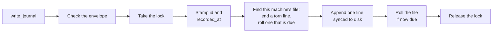
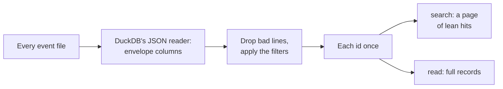

# The core module

The Python package in [`plugin/brain/`](../plugin/brain/) is the Brain's low-level interface to its data. It defines the shape of a record and the layout of the folders, and it holds the write path and the read path. Nothing else writes the files: an agent reaches them only through the MCP server, which calls this package. DuckDB, which reads them, cannot append to a JSONL file, and a DuckDB database allows only one process to write. The tests in [`tests/`](../tests/) drive it directly, with no server.

A Brain is an append-only log of events. It holds events, never current state; how things stand now is worked out by reading the events in order. A record is never edited, and a correction is a new entry.

| Module | Holds |
| --- | --- |
| [`format.py`](../plugin/brain/format.py) | The file format: the record's envelope and its checks, the one-line encoding, the folder layout, and file names. The read side imports it; it imports neither side. |
| [`write.py`](../plugin/brain/write.py) | `Writer.write_entry`, the one generic write. |
| [`read.py`](../plugin/brain/read.py) | `Reader`, the one read for every type: search, and full records by id, and resolving names to [entities](#entities). It imports the file format, never the write path. |
| [`entries.py`](../plugin/brain/entries.py) | One write method per supported type, over `write_entry`. |
| [`lock.py`](../plugin/brain/lock.py) | The OS lock that makes sessions on one machine take turns. |

## Folders

```
<event store>/                 synced between machines
  events/
    h-0199a8c4-….jsonl         sealed: its machine has moved on
    h-0199f02e-….jsonl         open: its machine appends here

<state folder>/                this machine's own, never synced
  <key>.lock                   the lock file
  <key>.json                   the file this machine appends to, and its line count
```

The event store is one flat `events/` folder. Each file is named `h-<uuidv7>.jsonl` for the time it was started, and only the machine that created it ever appends to it. A sync service copies whole files between machines, so two machines appending to one file would each overwrite the other's lines; with one owner per file, that never happens, and no machine is named in the layout. The state folder is never synced: the lock coordinates only this machine, and the current file is this machine's alone. `<key>` is a hash of the event store's path, so two Brains on one machine never share a lock or a current file. The caller hands the `Writer` both folders; the MCP server supplies the state folder.

## A record

Each record is one line of UTF-8 JSON, ended by a newline, with one envelope shared by every type. What a type adds goes in `details`, never beside the envelope, so every record has the same shape whatever its type: the read side's columns are fixed, and nothing a type adds can clash with a field of the envelope.

```json
{"id":"0199a8c4-…","type":"journal","version":1,
 "recorded_at":"2026-09-28T23:14:32Z","event_date":"2026-09-14",
 "description":"Oil change","source":"voice",
 "body":"## Service\nOil and filter changed…","details":{}}
```

| Field | Carries |
| --- | --- |
| `id` | A UUIDv7, stamped by the write path. Unique everywhere without coordination; it carries no meaning a query relies on. |
| `type` | The kind of entry, such as `journal`. |
| `version` | The version of that type's shape the record was written under, fixed by the type's method. |
| `recorded_at` | When it was written down, UTC, stamped by the write path. For display; nothing orders by it. |
| `event_date` | When the event happened, a local date. What a reader orders by. |
| `description` | A one-line summary. |
| `body` | Markdown: the account itself. |
| `source` | How the information arrived, such as `voice` or `email`. The only optional field. |
| `details` | What the type adds, as a JSON object; `{}` when it adds nothing. |

A record carries no writer and no position: its `id` lets it stand alone wherever it is copied. The newline ends a record. A line that is whole and valid JSON is a record, and anything else is a fragment a reader skips.

## Writing

A caller writes through a type's method, such as `Entries.write_journal`, which takes only that type's fields, fixes its `type` and `version`, and calls `Writer.write_entry`. The MCP server exposes the type methods, never `write_entry`. The types so far are `journal`, [`entity`](#entities), and [`snapshot`](#snapshots). A journal entry names the entities it is about, by slug, in `details.entities`, and `write_journal` refuses a slug no entity has been recorded under, with `UnknownEntities`, so an entry never names a subject nothing can resolve. Entities are never removed, so the check, made before the lock, cannot go stale.



- **Checks.** A blank or invalid envelope field, or `details` that is not a JSON object, raises `RecordError`, and nothing is written.
- **The lock.** An OS lock on the lock file in the state folder, never on a JSONL file: the holder may roll the file, and on Windows a lock on a file's bytes blocks everyone else from reading them. A session waits up to 30 seconds, then gets `LockTimeout`; the lock is held for milliseconds, so a longer wait means something has hung. The OS releases the lock when its process dies, so a crash leaves nothing behind.
- **This machine's file.** The state names the file and its line count. A file that is gone, or state that is missing or names another store, starts a new file; the machine never resumes a file it did not create.
- **A torn last line**, left by a crash mid-append, is ended with a newline before the next append. The fragment is never truncated: cutting bytes from a file the sync service may be copying can lose data.
- **Rolling.** A file rolls at 10,000 lines or 7 days old, by the time in its name. It is then sealed and never changes again, so a backup or a sync copies it once. The next append starts a new file. When a file rolls carries no meaning for a reader.
- **The append** is one unbuffered write, synced to disk before `write_entry` returns.
- **A blocked file.** An append that another process blocks, such as a sync service holding the file open, retries with backoff for up to 10 seconds under the lock, then raises `AppendBlocked`.

The Brain relies on the sync service to carry files between machines and does not coordinate them, so minor loss at the sync boundary is accepted.

## Reading

Writing is typed and reading is not. A type's write method controls the shape of what is recorded, so a caller never builds a record by hand; reading needs no such control, so `Reader` finds and returns entries of every type the same way, and the caller interprets what comes back by its type. Two calls cover it: `search` finds, `read` returns. Only `resolve`, which turns names into [entities](#entities), knows a type. They carry the mechanics of the files, so a caller needs only to know what to ask.

Every call reads every file afresh, through DuckDB's JSON reader, where the files lie: there is no index and no second copy, so a machine that has gone quiet can come back and its records are simply there. Each call opens its own in-memory DuckDB and closes it, so no database file is ever written. Reading never writes; a snapshot is written through the write path like any entry.



- **Bad lines.** A line that is not valid JSON, a torn last line among them, or that lacks a field of the envelope is skipped, never reported as an error. A last line that is whole JSON but not yet ended by its newline is read; the writer ends it before its next append.
- **Each id once.** A line copied into two files is the same record and is returned once. The copies are identical, so any one is kept, and the filters run first so only the matches are checked for copies.
- **Order is `event_date`**, then `id` to break ties, never `recorded_at` or file position: records from different files interleave only by what they say.
- **`search`** matches a pattern, a regular expression as grep takes, in any case, against the description and body of every type, or [entities](#entities) by slug, or both. It filters by type, by event dates, inclusive, by `recorded_after`, a UTC time, and by exact `details` fields. It returns one page of lean hits, oldest first unless asked for newest first: each hit's id, type, event date, recorded time, description, and a snippet of about 160 characters around the first match in the body, with the total across every page. A caller reads the hits and asks for full text only where it needs it.
- **`read`** returns the full records for a list of ids in one call, as objects in the envelope's shape with `details` parsed, in event-date order. An id not found is left out.

With 200,000 records in 20 files, a search with a pattern takes about 50 ms and a read about 40 ms.

### Entities

An entity is a person, thing, or topic entries are about, such as `dr-jekyll`, `zorblax`, or `mom`. Searching text cannot promise every entry on a subject: an entry that says "two drops of Moonberry extract with breakfast" never says "medication". Naming an entry's entities when it is written moves that judgment to the moment a model looks at one entry with its whole attention, and a search by entity then returns the whole set in one call. Over a fictional decade of entries, three models asked which medications were current missed or misstated one with text search alone, and all three answered fully searching by subject.

An entity is an entry of type `entity`, written through `Entries.write_entity`, never a list kept beside the log: a list of every subject loaded on every write costs tokens that grow with the vocabulary, while entities in the log are queried, so only the likely matches come back. Its description is its name, its body says what it is, and its `details` carry its `slug`, its `kind`, such as `person` or `medication`, and its `aliases`, the other names it goes by. Entries name it by slug. A record is never edited, so writing a slug again restates the entity, with its event date the day it was stated. Its name, kind, and body are the newest statement's, by event date and then id, and its aliases are every statement's: two machines that each add an alias before they sync lose neither, and a machine that has not yet seen an entity and records it again only adds to it.

```json
{"type":"entity","description":"Dr. Jekyll","body":"The family physician.",
 "details":{"slug":"dr-jekyll","kind":"person","aliases":["Dr. J"]}, …}
```

- **`resolve`** takes a list of names and returns, for each, up to five likely entities, best first, as each holds now: id, slug, name, kind, and aliases. A name is compared with an entity's slug, name, and aliases in any case, with punctuation and hyphens read as spaces. The same is the best match, then one held whole in the other as words, such as `jekyll` in `dr jekyll`, then one spelled alike by Jaro-Winkler similarity of at least 0.8. A name with nothing likely gets none. A writer passes every subject it finds in an entry, reuses an entity that matches, and creates one only when none does, so a subject is recorded once. Shorthand that spells nothing like the name, such as `meds` for `medication`, is found only through an alias.
- **Search by entity** returns the entries that name any of the slugs, and the entities themselves. Given a pattern as well, an entry is a hit when either finds it: requiring both would lose an entry whose entities were missed when it was written.

With 2,000 entities among 200,000 records, resolving ten names takes about 70 ms.

### Snapshots

A snapshot records a folded answer so it need not be recomputed, such as a list of the dragon's current hoard drawn from years of entries. It is an entry of type `snapshot`, written through `Entries.write_snapshot`, and only at the user's word. Its body holds the answer, its event date is the day it was taken, and its `details` carry `scope`, the question's meaning, put so paraphrases land on one scope.

A snapshot needs no read of its own. A caller finds the latest one for a question with `search`, then searches for what was recorded after it, reaching back a few days past its `recorded_at` for entries that synced late, and folds those in. The reach-back is the caller's to choose.

A record that syncs later than the reach-back is missed, and so is a record the model misread when folding. Both are accepted: a machine with no connection cannot reach the model to record anything, so a long delay is rare, and any store kept in step by a sync service has the same gap. Either is fixed the same way, by building the snapshot afresh from every matching entry and writing a new one.
