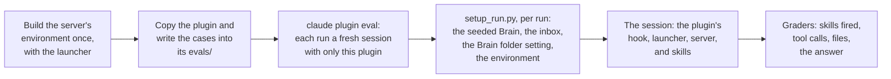

# Evals

The evals in [`tests/evals/`](../tests/evals/) test the whole plugin played through a model: the skills, the MCP server, the document script, and the core module together, the way a user meets them. The [unit tests](development.md#tests) prove each part does what it is told; the evals prove a model, given the plugin, tells them the right things. Each case is a prompt a user might type, and its graders check what the model did: which skill fired, which tools it called and with what arguments, which files it left, and what it answered.

## The seeded Brain

Every case runs against a fictional Brain, the same bytes every time, so a case that passes or fails does so for what the model did, never for what it found.

- **The stories** in [`stories.py`](../tests/evals/stories.py) are two invented timelines, June to September 2026: one at home, with a cottage, a hovercart, a teacup dragon, and a potion physician; one at work, on a moonberry juice extractor. Between them they hold 95 entries of every type the plugin writes: 59 journal entries, 25 entities, 9 filed documents, and 2 snapshots, with a correction, a merge, a subject known by another name, two people one name could mean, and facts that change over time. Two laptops wrote them, so the Brain holds event files from two machines, as a synced one does.
- **The seed** in [`seed.py`](../tests/evals/seed.py) writes the stories through the core module's write path and the document script's filing, so every slug, link, revision, and filed document passed the checks a live session's would. Only the clock and the random bits of each id are fixed. Its output, [`tests/evals/brain/`](../tests/evals/brain/), is checked in, and [`test_seed.py`](../tests/test_seed.py) rebuilds it and fails on any byte that differs, and on a link that names nothing, a merge that splits a set, or a filed document whose hash or path disagrees with its entry.

Run `python tests/evals/seed.py` after changing the stories, and commit the Brain it writes.

## The cases

[`cases.py`](../tests/evals/cases.py) holds every case with its graders, beside the facts they check.

| Set | Asks | Checked by |
| --- | --- | --- |
| Reads | questions about the stories, including how something stands now, what a correction changed, what a document says and where it is filed, what a merged or aliased subject did, and something never recorded | the query skill fired, a search ran, and the answer holds the story's facts: by pattern where the fact is exact, by a judge model where the answer must also leave something out |
| Writes | recording an event, in full and in brief, a passing mention, a new person, another name, a merge, a correction, a correction with news, a follow-on, a snapshot, a secret, and two that must record nothing | the skill that should fire did and the one that should not did not; each `write` call's arguments, matched as JSON: type, event date, links, the entry a revision names, and what must be absent |
| Filing | filing a document beside its like, a folder of two, a duplicate, and one with nothing like it | the files left in `documents/`, the document entry's path and hash, the journal entry recording the capture, and the refusal or question where nothing should be filed |
| Pointers | filing a file that only points elsewhere: to a shared spreadsheet out of reach, with and without the user saying what it holds, and to a file in the run's own folder | that no pointer is filed and each is left where it was; the question where nothing can be read; the journal entry's `address`; and the file it names filed as a copy, its original left in place |

What the graders do not check, the unit tests do: that a `write` given those arguments writes that record, that a merge or revision reads back whole, and that a filed document's file matches its hash.

## Running

```bash
python tests/evals/run.py --runs 1
```

Every option but `--bash` goes to [`claude plugin eval`](https://code.claude.com/docs/en/plugin-evals), such as `--case <glob>`, `--tag read`, `--runs 3`, `--model`, or `-j 4`. Each run is a real model session on your account, and a judged grader adds three short calls, so a pass over every case at one run each costs a few dollars. Judged graders use Sonnet unless `--judge-model` says otherwise: the default judge, a smaller model, failed correct answers over how a name or a date was written. Results, with a report to open, go to `tests/evals/results/`.



- **The harness is a copy of the plugin.** Plugin evals read a suite only from inside the plugin under test, and the tests stay out of `plugin/`, so [`run.py`](../tests/evals/run.py) copies the plugin into `tests/evals/.cache/harness/` and writes the cases into its `evals/`. Nothing in the copy changes: each run starts the real MCP server through the plugin's own config, hook, and launcher.
- **Each run gets what a configured machine has.** An eval run leaves the plugin's settings empty, so the Brain folder would be unset, the server would not start, and the skills would name no folder. [`setup_run.py`](../tests/evals/setup_run.py) runs as each case's scaffold and writes the setting into the run's own configuration, beside a copy of the seeded Brain in the run's folder. It also copies in the server's environment, built once by the launcher, since building it in every run takes minutes; the launcher finds it holding the same pins and starts at once.
- **Only this plugin loads.** An eval run has its own home and configuration, with none of the user's plugins, settings, memory, or MCP servers.
- **Filing needs a shell.** The document skill files through its script, so the filing cases need Bash, and an eval run grants a shell only where Claude Code can sandbox it: macOS, Linux, and WSL2. On Windows `run.py` leaves those cases out and says so.
