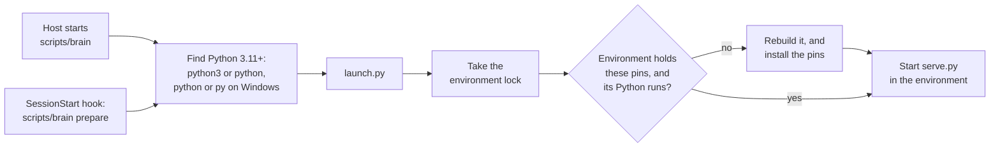

# The MCP server

The MCP server in [`plugin/server/`](../plugin/server/) is how an agent reaches the Brain. It wraps [the core module](core-module.md) and holds no logic about the data of its own: every tool calls the core module, so every tool runs code the core module's tests already cover. It carries the rules itself, in each tool's description, so an agent without the skills gets the same behavior.

| Module | Holds |
| --- | --- |
| [`serve.py`](../plugin/server/serve.py) | The server and its tools, built on the official MCP SDK. |
| [`folders.py`](../plugin/server/folders.py) | Finding the Brain folder and the plugin data folder. Standard library only, so the launcher can use it. |
| [`launch.py`](../plugin/server/launch.py) | Preparing the machine and starting the server. Standard library only. |

The plugin's [`.mcp.json`](../plugin/.mcp.json) starts the server, its [`hooks/hooks.json`](../plugin/hooks/hooks.json) prepares the machine as a session opens, and its [manifest](../plugin/.claude-plugin/plugin.json) asks for the Brain folder.

## Starting

The server runs over stdio: the agent's host starts it for a session and stops it with the session. It runs on the machine's own Python, 3.11 or later, in a virtual environment that holds the SDK.

- **The launch scripts.** No one command starts Python everywhere: Windows has `python` and `py`, where `python3` is often a stub that offers to install it, and macOS and many Linux systems have only `python3`. So the host runs [`scripts/brain`](../plugin/scripts/brain), a POSIX shell script, or on Windows [`brain.cmd`](../plugin/scripts/brain.cmd) beside it, and each tries its candidates in turn, taking the first that is 3.11 or later. The scripts are in `scripts/`, not `bin/`: claude.ai and Cowork do not install a plugin with a top-level `bin/` folder.
- **Preparing.** [`requirements.txt`](../plugin/requirements.txt) pins every package the server needs, with its hashes, for every platform, and pip installs it with `--require-hashes`, so every machine runs the same packages and none can be swapped later. The environment is built in the plugin data folder, which survives plugin updates, and is rebuilt whole when the pins change or its Python no longer runs, so nothing an older pin installed lingers. The copy of the pins in the environment is written last, so one a crash left half built is built again.
- **Two callers, one lock.** The SessionStart hook prepares the environment as soon as a session opens, with the hook's ten minutes rather than the host's shorter wait for a server to start, and Claude's first reply waits for it. The launcher prepares the same way before it starts the server, so the server still starts on a host that runs no hooks. A lock in the plugin data folder makes them take turns, and the second finds the work done. A first start that runs out of time costs that session its tools; the install finishes, and the next session starts in about a second.
- **The SDK.** The server is built on the official MCP Python SDK rather than a protocol written here, so the protocol is kept correct by its maintainers. The cost is about 30 packages, a download of about 20 seconds on a machine's first session, and an occasional pin bump when a new Python needs newer builds of the SDK's compiled packages.

## Folders

| Folder | Set by | Holds |
| --- | --- | --- |
| The Brain folder | the user, once per machine | the records in `events/` and the filed documents in `documents/` |
| The plugin data folder | the host | the virtual environment, and the lock, current file, and index the core module keeps |

- **The Brain folder** comes from `BRAIN_DIR`, which the plugin sets from the `brain_folder` option the user chooses when the plugin is enabled. It must exist: a sync folder that is not mounted must not quietly become a new, empty Brain. A second machine pointed at the same synced folder reaches the same Brain as another writer.
- **The plugin data folder** is the first of these that is set: `BRAIN_DATA_DIR`, `CLAUDE_PLUGIN_DATA`, `PLUGIN_DATA`, `COPILOT_PLUGIN_DATA`, and otherwise a fixed folder for the user, `%LOCALAPPDATA%\AI.Brain` on Windows, `~/Library/Application Support/AI.Brain` on macOS, and `~/.local/share/ai-brain` elsewhere. Hosts name the plugin's data folder differently, and some give none. The plugin's server config sets `BRAIN_DATA_DIR` to `${CLAUDE_PLUGIN_DATA}`, for hosts that expand the variable in config but do not pass it on. A value still holding `${` was not expanded, and counts as unset. The launcher logs which folder it chose and why.
- **The plugin data folder is never inside the Brain folder or the plugin's install folder**, which is replaced on every update, and the server refuses to start with one that is. Any other choice is safe: sessions that do not share a plugin data folder write separate files and never touch each other's, so a host that gives each session a fresh folder costs only small files and a fresh environment. Cowork is reported to give each conversation a data folder of its own; that is unconfirmed.

## Tools

| Tool | Does |
| --- | --- |
| `write_journal` | records a journal entry and returns its id |
| `revise_journal` | revises a journal entry's description, event date, or entities, or adds an amendment, and returns the revision's id |
| `write_entity` | records or restates an entity and returns its id |
| `write_snapshot` | records a folded answer and returns its id |
| `search` | finds entries of every type by words or entities, type, event date, recorded time, and `details` fields, returning each hit's id, type, event date, recorded time, description, and a snippet: every hit, or a failure telling how to refine a search that finds more than 100 |
| `read` | returns full records for a list of ids in one call |
| `resolve` | returns the likely matching entities for each of a list of names |
| `store_document` | files a copy of a document into `documents/` and returns its path and hash |

Each supported type has a write tool of its own, over the core module's type methods, never the generic write. Each tool returns one JSON object, compact, as its text. Reads are marked read-only, so a host can allow them without asking.

A failure the model can put right comes back as an error result carrying the core module's message, which says how: an unknown entity, a bad date or pattern, a search past the ceiling with the ranges to search instead, a document path that is taken, or a lock or file another process held too long. Any other failure is a crash, logged with its traceback, and the model sees only that the tool failed.

A filed document is a copy of the file, kept in the Brain folder's `documents/` at its path, with its `sha256`, through the core module's [documents store](core-module.md#documents). An entry names a document it is about in its `details`, by path and `sha256`, filed first, so a pointer never points at nothing.
