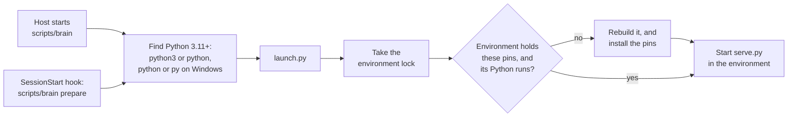

# The MCP server

The MCP server in [`plugin/server/`](../plugin/server/) is how an agent reaches the Brain. It is the translation between [the core module](core-module.md) and the model's context, and holds no logic about the data of its own: every tool calls the core module, so every tool runs code the core module's tests already cover. No tool is for a particular type of entry, so the server is never extended for a new one; what a type means is [the skill's](skills.md) that writes it. It carries the core module's rules in each tool's description, so an agent without the skills still writes valid entries.

| Module | Holds |
| --- | --- |
| [`serve.py`](../plugin/server/serve.py) | The server and its tools, built on the official MCP SDK. |
| [`folders.py`](../plugin/server/folders.py) | Finding the Brain folder and the plugin data folder. Standard library only, so the launcher can use it. |
| [`launch.py`](../plugin/server/launch.py) | Preparing the machine and starting the server, and running a skill's own script with `run`. Standard library only. |

The plugin's [`.mcp.json`](../plugin/.mcp.json) starts the server, its [`hooks/hooks.json`](../plugin/hooks/hooks.json) prepares the machine as a session opens, and its [manifest](../plugin/.claude-plugin/plugin.json) asks for the Brain folder.

## Starting

The server runs over stdio: the agent's host starts it for a session and stops it with the session. It runs on the machine's own Python, 3.11 or later, in a virtual environment that holds the SDK.

- **The launch scripts.** No one command starts Python everywhere: Windows has `python` and `py`, where `python3` is often a stub that offers to install it, and macOS and many Linux systems have only `python3`. So the host runs [`scripts/brain`](../plugin/scripts/brain), a POSIX shell script, or on Windows [`brain.cmd`](../plugin/scripts/brain.cmd) beside it, and each tries its candidates in turn, taking the first that is 3.11 or later. A skill runs its own script through them too, with `run`, on that Python and outside the server's environment, so such a script uses the standard library only. The scripts are in `scripts/`, not `bin/`: claude.ai and Cowork do not install a plugin with a top-level `bin/` folder.
- **Preparing.** [`requirements.txt`](../plugin/requirements.txt) pins every package the server needs to an exact version, for every platform, so every machine runs the same set the tests passed with, and a new release of a package several steps down the chain cannot break one install and not another. The pins do not go stale: Dependabot opens a pull request each week bumping them, and one for a security fix as soon as it is published, and CI tests each on every platform before it merges. The pins are compiled from [`requirements.in`](../plugin/requirements.in), which names only the packages the server uses, and Dependabot recompiles the whole set for each bump, so packages released in lockstep move together: bumping each pin on its own once proposed a `pydantic-core` that no stable `pydantic` accepted. Hashes were left out: they guard only against a file added to an already-pinned version, they made the file hundreds of lines long, and Dependabot keeps plain pins current where it cannot regenerate hashes for every platform. The environment is built in the plugin data folder, which survives plugin updates, and is rebuilt whole when the pins change or its Python no longer runs, so nothing an older pin installed lingers. The copy of the pins in the environment is written last, so one a crash left half built is built again.
- **Two callers, one lock.** The SessionStart hook prepares the environment as soon as a session opens, with the hook's ten minutes rather than the host's shorter wait for a server to start, and Claude's first reply waits for it. The launcher prepares the same way before it starts the server, so the server still starts on a host that runs no hooks. A lock in the plugin data folder makes them take turns, and the second finds the work done. A first start that runs out of time costs that session its tools; the install finishes, and the next session starts in about a second.
- **The SDK.** The server is built on the official MCP Python SDK rather than a protocol written here, so the protocol is kept correct by its maintainers. The cost is about 30 packages, a download of about 20 seconds on a machine's first session, and an occasional pin bump when a new Python needs newer builds of the SDK's compiled packages.

## Folders

| Folder | Set by | Holds |
| --- | --- | --- |
| The Brain folder | the user, once per machine | the records in `events/` and the filed documents in `documents/` |
| The plugin data folder | the host | the virtual environment, and the lock, current file, and index the core module keeps |

- **The Brain folder** comes from `BRAIN_DIR`, which the plugin sets from the `brain_folder` option the user chooses when the plugin is enabled. It must exist: a sync folder that is not mounted must not quietly become a new, empty Brain. A second machine pointed at the same synced folder reaches the same Brain as another writer.
- **The plugin data folder** is the first of these that is set: `BRAIN_DATA_DIR`, `CLAUDE_PLUGIN_DATA`, `PLUGIN_DATA`, `COPILOT_PLUGIN_DATA`, and otherwise a fixed folder for the user, `%LOCALAPPDATA%\AI.Brain` on Windows, `~/Library/Application Support/AI.Brain` on macOS, and `~/.local/share/ai-brain` elsewhere. Hosts name the plugin's data folder differently, and some give none. The plugin's server config sets `BRAIN_DATA_DIR` to `${CLAUDE_PLUGIN_DATA}`, for hosts that expand the variable in config but do not pass it on. A value still holding `${` was not expanded, and counts as unset. The launcher logs which folder it chose and why.
- **The plugin data folder is never inside the Brain folder or the plugin's install folder**, which is replaced on every update, and the server refuses to start with one that is. Any other choice is safe: sessions that do not share a plugin data folder write separate files and never touch each other's, so a host that gives each session a fresh folder costs only small files and a fresh environment. Cowork is reported to give each conversation a data folder of its own; that is unconfirmed.

## Tools

| Tool | Does |
| --- | --- |
| `write` | creates an entry of any type under a slug, or revises one given its id, and returns the record's id |
| `search` | finds entries of every type by words, slugs, or names, type, event date, recorded time, and `details` fields, returning each hit's id, type, slugs, event date, recorded time, description, snippet, and the names that found it: every hit, or a failure telling how to refine a search that finds more than 100 |
| `read` | returns the entries for a list of ids in one call, as Markdown |

These three are the only tools, each calling the core module's operation of the same name, `Writer.write`, `Reader.search`, and `Reader.read`, directly. Work a skill needs beyond entries is the skill's own: the document skill files a document's file with a script of its own, which it runs through the launcher's `run` command, so it reaches Python the same way the server does on every machine. Each tool returns one JSON object, compact, as its text, except `read`. Reads are marked read-only, so a host can allow them without asking.

- **`read` returns Markdown.** The core module keeps every record as JSON; the server translates for the model at this boundary. Each entry is a heading of its description, a line of its fields, its slugs, aliases, and links, the entry it is merged into if any, and its details, then its body on real lines and its amendments under it, with entries separated by a line of `---`. A host passes a large result to the model as a file instead of inline, and JSON puts a whole body on one escaped line that a model cannot page through; in testing, a model reading four long entries as JSON spent over a minute slicing that line apart, where as Markdown it read them inline, or with one ordinary read of the file.
- **`read` has no ceiling of its own.** It returns every record asked for, and the host decides whether a result goes to the model inline or as a file. The host knows its model and tools, and its thresholds can change from one release to the next, so the server does not try to match them. The MCP protocol sets no limit. Claude Code puts at most 25,000 tokens of a tool result in front of the model by default (`MAX_MCP_OUTPUT_TOKENS`), and saves a larger result whole to a file the model reads a part at a time: tested with reads of 100,000, 200,000, and 300,000 tokens of real entries, every file matched what the server sent, to the character. What limits a large read is how much the model can hold at once, so reading long entries a handful at a time is the query skill's guidance, not a refusal in the tool.

A failure the model can put right comes back as an error result carrying the core module's message, which says how: a slug already taken, with the entry that carries it, a link no entry carries, a bad date or pattern, a search past the ceiling with the ranges to search instead, or a lock or file another process held too long. Any other failure is a crash, logged with its traceback, and the model sees only that the tool failed.
