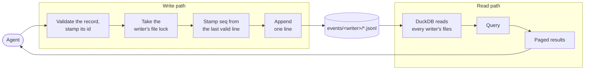

# Reading and writing

The two paths share only the files. The write path never loads DuckDB, and DuckDB never writes the record.

## Reading

- **DuckDB reads the JSONL files in place**, across every writer's folder, through views over the files. There is no index and no second copy.
- **Results come back lean and paged**: each hit's id, date, description, and a snippet, with `read` fetching full entries by id.

## Writing

- **Only the server writes the files.** It validates each record and stamps its id and sequence number. A person or a model never edits a file by hand.
- **Each record is one line of JSON** in a JSONL file, appended and never edited, as [`data-format.md`](data-format.md) sets out.
- **One writer per machine install.** Every session on a machine appends to that machine's stream, taking turns through an OS file lock. Only its own machine ever changes a stream, so a sync service uploads each machine's stream from that machine alone; [the decision](decisions/one-writer-stream-per-machine.md) says why.
- **Files roll at 10,000 lines.** The full file is sealed and never changes again, and appends move to the next numbered file, so a backup or a sync copies a sealed file once.
