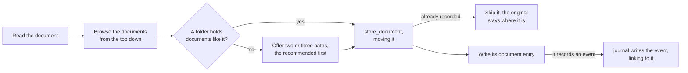

# The skills

The skills in [`plugin/skills/`](../plugin/skills/) carry what the tools cannot: what each type of entry is, what is worth recording, what to ask first, how an entry reads, where a document belongs, and how entries fold into an answer. [The MCP server](mcp-server.md) knows no type: it carries the core module's rules, in each tool's description and in what it refuses, so an agent without the skills still writes valid entries. A skill holds what a tool's description should not, and never restates what a tool enforces.

**A skill defines its type.** It gives `write` the type and version as fixed values, and leaves placeholders for the model to fill, so the shape of each type lives in one place. A skill someone writes for their own use defines a type of its own the same way, with no change to the server.

**Each skill teaches the tools' use, not only the judgment.** Offered a way to search by subject with no guidance, two of three models ignored it and missed entries; one line of guidance made all three answer fully.

| Skill | Type | Does |
| --- | --- | --- |
| [`journal`](../plugin/skills/journal/SKILL.md) | `journal` | records an event as a journal entry, or corrects one, and decides unprompted whether an event deserves one |
| [`entity`](../plugin/skills/entity/SKILL.md) | `entity` | records a subject entries are about, adds a name to one, or merges two that turn out to be one |
| [`snapshot`](../plugin/skills/snapshot/SKILL.md) | `snapshot` | records a folded answer, at the user's word |
| [`intake`](../plugin/skills/intake/SKILL.md) | `document` | files a document into the Brain's documents and records it as a document entry |
| [`query`](../plugin/skills/query/SKILL.md) | | answers a question from what was recorded, by searching, reading, and folding the entries that bear on it |

## Journal

`journal` asks follow-up questions until the account is complete, finds the entry's subjects, reads the newest entry like it to match its layout, and writes it.

- **Unprompted, it judges whether the user was a party to the event and whether it has happened**, not how important it seems. A party's account of something done is recorded; an observation, an intention, or something found is offered first; the session's own work is never recorded.
- **It asks before guessing.** An entry is permanent, so an unclear date, name, or figure goes to the user before it is written.
- **The description is written for triage**, such as "Oil change at 48k, rear brakes flagged as worn" rather than "Oil change". A search returns only lean hits, so the description decides whether an entry is read, and it is written once, by a model looking at that entry alone.
- **The slug is the date and a few words**, so it reads as the event it names.
- **Subjects are found before writing**, every one at once by a search by names, including the broad subject an entry falls under, so a question about the whole subject finds it. The entry links to each, and to an earlier entry it follows on from; a subject with no match is recorded through `entity`.
- **A correction and new information are separate writes.** A correction fixes what an entry recorded wrong and revises that entry; new information about the same story is a new entry on its own date, linking to the one it follows on from. One account that carries both produces both. Telling the parts apart means reading the whole account against the entry, which takes judgment, so the skill does it and no tool can.
- **An entry keeps every link or reference to where more of its account lives**, so a later query can follow it.
- **A document that records an event gets an event entry** linking to the document's entry, dated by the event; documents about one event share it.

## Entity

`entity` records the people, things, and topics entries link to.

- **It searches before it records**, by every name the subject goes by, and asks about a match that is plausible but uncertain: a wrong match merges two real things, and a needless new entity splits one.
- **Another name is an alias**, added by a revision, so a search by that name finds it.
- **A merge is one revision**, adding the other's slug and names to the one kept, and only at the user's word unless they asked for it.

## Snapshot

`snapshot` records a folded answer, only at the user's word, built afresh from every matching entry rather than from an earlier snapshot, so a record that synced late or was misread is caught. Its slug is its scope and the day it was taken, and it links to the subjects it covers, so a later question finds it by them.

## Query

`query` finds the question's subjects, searches by their slugs plus words for wording they might miss, reads only the ids it picks, and folds them into an answer.

- **One search by slugs and words.** An entry is a hit when either finds it, so an entry whose links were missed is still found by its wording. The skill searches again only where the hits leave a gap.
- **It reads long entries a handful at a time.** `read` has no ceiling of its own, and a result too large to show inline costs the model turns to page through and room in what it can hold.
- **A search past the ceiling is walked range by range** when an answer needs everything about a subject, folding as it reads rather than loading every body at once. That walk is an expensive fold, so it ends in an offered snapshot.
- **It answers briefly and invites the follow-up.** An answer carries what it takes to answer the question and says where more is available, rather than synthesizing everything it read. Writing the answer took a third of all query time in testing, growing with its length.
- **It goes beyond the Brain where the answer needs it.** Where the record points elsewhere, or the question needs facts it never held, the skill follows it to whatever other sources the session can reach and folds them in. It keeps the two apart in the answer, since the record holds what was known when it was written and another source holds what it says now, and it sends outside only what a lookup needs. What it finds is never recorded on its own: the journal skill offers it first.
- **A later question starts from the latest snapshot** of its subjects whose scope fits, and folds in what was recorded after it.

## Intake

Handed a file, `intake` reads it, chooses where it belongs with `list_documents`, files it with `store_document`, and records it as a document entry carrying its contents.

- **The document moves, not a copy.** One copy remains, and it is the filed one, so a folder of documents to deal with empties as they are handled.
- **The documents folder is organized for a person.** The user browses it by hand, so it grows in up to three levels a person would look through: an area, the specific thing within it, and the kind of document, such as `assets/blue-hatchback/service/`. A file is named for the date of the event it records, then what it is, so a folder lists by when things happened. Where the folders in use follow a pattern of their own, the skill follows that instead.
- **It asks only where nothing is like it.** A document whose like is already filed goes beside it without asking; otherwise the user picks from two or three paths, so placement stays the user's call without a question for every document.
- **A document is filed once.** `store_document` refuses contents a document entry already names, so a duplicate is caught by the tool, not by the skill.
- **The document entry carries its contents**, less any boilerplate, and links to its subjects. A search finds the entry and an answer folds it in, so the contents are in the record without opening the file; the file is there to go back to.
- **A changed document revises its entry** with its new `sha256`, so the original's hash still says what the document was when it was recorded.
- **A web page is never copied into the Brain.** The skill offers to journal what it says instead.
