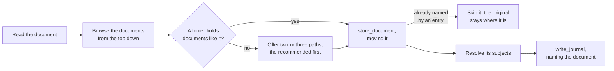

# The skills

The skills in [`plugin/skills/`](../plugin/skills/) carry the judgment the tools cannot: what is worth recording, where a document belongs, how an entry reads. [The MCP server](mcp-server.md) carries the rules, in each tool's description and in what it refuses, so an agent without the skills still writes valid records; a skill teaches how to use the tools well, and never restates what a tool enforces.

| Skill | Does |
| --- | --- |
| [`intake`](../plugin/skills/intake/SKILL.md) | files a document into the Brain's documents and writes the one journal entry that carries its contents |

## Intake

Handed a file, `intake` reads it, chooses where it belongs with `list_documents`, files it with `store_document`, and records it with `write_journal`.

- **The document moves, not a copy.** One copy remains, and it is the filed one, so a folder of documents to deal with empties as they are handled.
- **The documents folder is organized for a person.** The user browses it by hand, so it grows in up to three levels a person would look through: a life area, the specific thing, and the kind of document, such as `assets/blue-hatchback/service/`. A file is named for the date of the event it records, then what it is, so a folder lists by when things happened. Where the folders in use follow a pattern of their own, the skill follows that instead.
- **It asks only where nothing is like it.** A document whose like is already filed goes beside it without asking; otherwise the user picks from two or three paths, so placement stays the user's call without a question for every document.
- **The entry carries the contents.** A search finds the entry and an answer folds it in, so the document's contents are in the record without opening the file; the file is there to go back to.
- **A document is filed once.** `store_document` refuses contents an entry already names, so a duplicate is caught by the tool, not by the skill.
- **A batch groups by event.** Documents about one event share an entry naming each; unrelated documents get entries of their own.
- **A web page is never copied into the Brain.** The skill offers to journal what it says instead.
