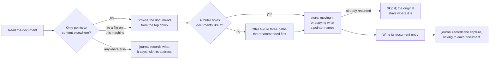

# The skills

The skills in [`plugin/skills/`](../plugin/skills/) carry what the tools cannot: what each type of entry is, what is worth recording, what to ask first, how an entry reads, where a document belongs, and how entries fold into an answer. [The MCP server](mcp-server.md) knows no type: it carries the core module's rules, in each tool's description and in what it refuses, so an agent without the skills still writes valid entries. A skill holds what a tool's description should not, and never restates what a tool enforces.

**A skill defines its type.** It gives `write` the type and version as fixed values, and leaves placeholders for the model to fill, so the shape of each type lives in one place. A skill someone writes for their own use defines a type of its own the same way, with no change to the server, as [Extending the Brain](extending.md) describes.

**An entry reads on its own.** Its description and body carry everything a reader needs, so `query` answers from entries of any type without loading the skill that wrote them. `details` holds only values a skill matches exactly, such as a document's `sha256` or a snapshot's `scope`.

**Work beyond entries is the skill's own.** A skill that needs more than writing and reading entries carries a script for it beside its `SKILL.md`, standard library only, and runs it through the plugin's launcher with `run`, so it reaches Python the same way the server does on every machine. The script can call the core module, which is standard library only too, to search what is recorded. The skill's text names the script by `${CLAUDE_SKILL_DIR}`, and hands it the Brain folder by `${user_config.brain_folder}` and the plugin data folder, where the index is, by `${CLAUDE_PLUGIN_DATA}`, all of which the host fills in when the skill loads.

**Each skill teaches the tools' use, not only the judgment.** Offered a way to search by subject with no guidance, two of three models ignored it and missed entries; one line of guidance made all three answer fully.

| Skill | Type | Does |
| --- | --- | --- |
| [`journal`](../plugin/skills/journal/SKILL.md) | `journal` | records an event as a journal entry, or corrects one, and decides unprompted whether an event deserves one |
| [`entity`](../plugin/skills/entity/SKILL.md) | `entity` | records a subject entries are about, adds a name to one, or merges two that turn out to be one |
| [`snapshot`](../plugin/skills/snapshot/SKILL.md) | `snapshot` | records a folded answer, at the user's word |
| [`document`](../plugin/skills/document/SKILL.md) | `document` | files a document into the Brain's documents, records it as a document entry, and has `journal` record the capture |
| [`query`](../plugin/skills/query/SKILL.md) | | answers a question from what was recorded, by searching, reading, and folding the entries that bear on it |

## Journal

`journal` finds the entry's subjects, reads the newest entry on the same subject to match its layout, and writes what it was given.

- **Unprompted, it judges whether the user was a party to the event and whether it has happened**, not how important it seems. A party's account of something done is recorded; an observation, an intention, or something found is offered first; the session's own work is never recorded.
- **It asks only where a reader later could not follow what happened.** An entry is permanent, so what the account depends on and leaves out or leaves unclear goes to the user before it is written, and a date, name, or figure is never guessed. Detail the account could hold but does not need is never asked for: asked to record a simple event, a model that went on to ask for every detail a long entry might hold recorded nothing.
- **The newest entry it reads is one on the same subject**, found by the subject's slug, so the search stays small: the newest of every journal entry is a search past the ceiling in a Brain of any size.
- **The description is written for triage**, such as "Oil change at 48k, rear brakes flagged as worn" rather than "Oil change". A search returns only lean hits, so the description decides whether an entry is read, and it is written once, by a model looking at that entry alone.
- **The slug is the date and a few words**, so it reads as the event it names.
- **Subjects are found before writing**, every one at once by a search by names, including the broad subject an entry falls under, so a question about the whole subject finds it. The entry links to each, and to an earlier entry it follows on from; a subject with no match is recorded through `entity`.
- **A correction and new information are separate writes.** A correction fixes what an entry recorded wrong and revises that entry; new information about the same story is a new entry on its own date, linking to the one it follows on from. One account that carries both produces both. Telling the parts apart means reading the whole account against the entry, which takes judgment, so the skill does it and no tool can.
- **An entry keeps every link or reference to where more of its account lives**, so a later query can follow it.
- **Captured documents get a journal entry** recording what they say, summarized, and what surrounds them, linking to each document entry; documents about one event share it.
- **Content kept elsewhere is recorded with its address**, as `address` in the entry's details. It can change, so a later reading is a new entry, never an amendment, and a search by that address finds every reading of it, each dated by when it was read.

## Entity

`entity` records the people, things, and topics entries link to.

- **It searches before it records**, by every name the subject goes by, and asks about a match that is plausible but uncertain: a wrong match merges two real things, and a needless new entity splits one.
- **Another name is an alias**, added by a revision, so a search by that name finds it.
- **A merge is one revision**, adding the other's slug and names to the one kept, and only at the user's word unless they asked for it.

## Snapshot

`snapshot` records a folded answer, only at the user's word, built afresh from every matching entry rather than from an earlier snapshot, so a record that synced late or was misread is caught. Its slug is its scope and the day it was taken, and it links to the subjects it covers, so a later question finds it by them.

## Query

`query` finds the question's subjects, searches by their slugs plus words for wording they might miss, reads only the ids it picks, and folds them into an answer.

- **One search by slugs and words.** An entry is a hit when either finds it, so an entry whose links were missed is still found by its wording. The skill searches again only where the hits leave a gap.
- **It reads long entries a handful at a time.** `read` has no ceiling of its own, and a result too large to show inline costs the model turns to page through and room in what it can hold.
- **A search past the ceiling is walked range by range** when an answer needs everything about a subject, folding as it reads rather than loading every body at once. That walk is an expensive fold, so it ends in an offered snapshot.
- **It answers briefly and invites the follow-up.** An answer carries what it takes to answer the question and says where more is available, rather than synthesizing everything it read. Writing the answer took a third of all query time in testing, growing with its length.
- **It goes beyond the Brain where the answer needs it.** Where the record points elsewhere, or the question needs facts it never held, the skill follows it to whatever other sources the session can reach and folds them in. It keeps the two apart in the answer, since the record holds what was known when it was written and another source holds what it says now, and it sends outside only what a lookup needs. What it finds is never recorded on its own: the journal skill offers it first.
- **A later question starts from the latest snapshot** of its subjects whose scope fits, and folds in what was recorded after it.

## Document

Handed a file, `document` reads it, chooses where it belongs, files it with its script, which refuses one filed already, and records it as a document entry carrying its contents. Once a batch is filed, `journal` writes the entry recording the capture, linking to each document entry. One handing-over can so become many entries: one per document, and one for what was captured.

- **The document moves, not a copy.** One copy remains, and it is the filed one, so a folder of documents to deal with empties as they are handled. A file a pointer names is copied instead, since whatever else uses the pointer still expects it where it is.
- **The documents folder is organized for a person.** The user browses it by hand, so it grows in up to three levels a person would look through: an area, the specific thing within it, and the kind of document, such as `assets/blue-hatchback/service/`. A file is named for the date of the event it records, then what it is, so a folder lists by when things happened. Where the folders in use follow a pattern of their own, the skill follows that instead.
- **It asks only where nothing is like it.** A document whose like is already filed goes beside it without asking; otherwise the user picks from two or three paths, so placement stays the user's call without a question for every document.
- **A document is filed once.** The script refuses contents a document entry already names, so a duplicate is caught by code, not by the skill's judgment.
- **The document entry carries its contents**, less any boilerplate, and links to its subjects, with its `path` and `sha256` in its details, written after the file is filed, so a pointer never points at nothing. A search finds the entry and an answer folds it in, so the contents are in the record without opening the file; the file is there to go back to.
- **Documents already filed are checked, never filed again.** The user browses the documents folder and may edit, move, add, or delete files in it by hand. Told a document changed, handed one already there, or asked, the skill checks that document, its folder, or every one, and records what the check reports: a changed document revises its entry with its new `sha256` and an amendment saying what changed, so the original hash still says what it was when recorded; a moved one revises its `path`; one no entry names gets its entry; and one gone is asked about.
- **Content kept elsewhere is never filed.** A web page, or a file whose contents only point to content kept elsewhere, would put a few bytes of address in the Brain, with none of the content, and a hash that never changes when the content does. The skill reads the content through whatever the session can reach, or asks what it holds, and `journal` records what it says with its address. The pointer file stays where it was.
- **The model, not the script, recognizes a pointer.** It reads every file before filing it, and a pointer's contents are plainly an address; the script could tell one apart only by a list of every product's pointer format, and the skill names no product, so it covers any that leaves one.

### The script

The skill's file work is done by [`documents.py`](../plugin/skills/document/scripts/documents.py), which files a document into the Brain folder's `documents/`, lists one folder of it, and checks it against the document entries, each printing one JSON object.

- **Contents already recorded are refused.** Before filing, the script hashes the file and searches, through the core module and the same index the server reads, for a document entry naming that `sha256`; one found means the document is filed already, and the refusal says where and which entry records it, leaving the original where it was. Contents filed but not yet recorded, as a crash between filing and writing leaves them, file again as they are, so the entry can still be written.
- **A path keeps its contents.** Filing the same contents at a path again returns it as it is, and filing others there is refused, so a pointer to a document never comes to point at something else.
- **A file already in `documents/` is never filed again.** Filing it would copy it, or, moved, leave the entries naming it pointing at nothing, so the refusal says to check it instead.
- **Checking compares the documents with the entries.** It hashes every document at a folder, at one document, or in all of `documents/`, and compares them with every document entry, found by a search for the type, split by event-date ranges where one search would pass the ceiling. A document whose contents differ from its entry's `sha256` is changed; an entry whose document is gone is moved when the same contents sit at a path no entry names, and missing otherwise; and a document no entry names is unrecorded. The check is the script's, not `read`'s, since the core module knows no type of entry. It reads every document it checks whole, which in a synced folder of cloud placeholders downloads each one, so the skill checks no more than it is asked to.
- **An original that cannot be removed** is reported after the document is filed, with its path and `sha256`, so the entry can still name it.
- **The copy is whole or absent.** It is written beside its path, synced to disk, and renamed into place, so a sync service never carries a part-written document. The original's modified time is kept where the folder allows it.
- **Paths are plain.** A path is relative, with `/` between folders, and no name in it is empty, `.` or `..`, ends in a dot or a space, holds a character Windows forbids, or is a name Windows keeps for a device, so a document filed on one machine can be synced to any other.
- **The Brain folder must exist**, so a sync folder that is not mounted never quietly becomes a new, empty Brain.

