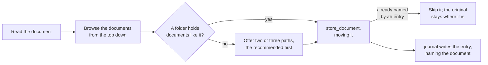

# The skills

The skills in [`plugin/skills/`](../plugin/skills/) carry the judgment the tools cannot: what is worth recording, what to ask first, how an entry reads, where a document belongs, and how entries fold into an answer. [The MCP server](mcp-server.md) carries the rules, in each tool's description and in what it refuses, so an agent without the skills still writes valid records; a skill holds the longer guidance a tool's description should not, and never restates what a tool enforces.

**Each skill teaches the tools' use, not only the judgment.** Offered a way to search by subject with no guidance, two of three models ignored it and missed entries; one line of guidance made all three answer fully.

| Skill | Does |
| --- | --- |
| [`journal`](../plugin/skills/journal/SKILL.md) | records an event as a journal entry, or corrects one, and decides unprompted whether an event deserves one |
| [`query`](../plugin/skills/query/SKILL.md) | answers a question about the user's life by searching, reading, and folding the entries that bear on it |
| [`intake`](../plugin/skills/intake/SKILL.md) | files a document into the Brain's documents and writes the one journal entry that carries its contents |

## Journal

`journal` asks follow-up questions until the account is complete, resolves the entry's entities, reads the newest entry like it to match its layout, and writes through `write_journal`.

- **Unprompted, it judges whether the user was a party to the event and whether it has happened**, not how important it seems. A party's account of something done is recorded; an observation, an intention, or something found is offered first; the session's own work is never recorded.
- **It asks before guessing.** An entry is permanent, so an unclear date, name, or figure goes to the user before it is written.
- **The description is written for triage**, such as "Oil change at 48k, rear brakes flagged as worn" rather than "Oil change". A search returns only lean hits, so the description decides whether an entry is read, and it is written once, by a model looking at that entry alone.
- **Entities are resolved before writing**, every subject at once, including the broad subject an entry falls under, so a question about the whole subject finds it. A match that is plausible but uncertain goes to the user: a wrong match merges two real things, and a needless new entity splits one.
- **A correction and new information are separate writes.** A correction fixes what an entry recorded wrong and goes through `revise_journal` on that entry; new information about the same story is a new entry on its own date, connected by the entities it shares. One account that carries both produces both. Telling the parts apart means reading the whole account against the entry, which takes judgment, so the skill does it and no tool can.
- **An entry about a document carries its contents** and names it by path and `sha256`. A search finds the entry and an answer folds it in, so the contents are in the record without opening the file; the file is there to go back to. A document that later changes is a new event, recorded in a new entry naming its new `sha256`, so an old entry's hash still says what the document was when it was written.

## Query

`query` resolves the question's subjects, searches by those entities plus words for wording they might miss, reads only the ids it picks, and folds them into an answer.

- **One search by entities and words.** An entry is a hit when either finds it, so an entry whose entities were missed is still found by its wording. The skill searches again only where the hits leave a gap.
- **It reads long entries a handful at a time.** `read` has no ceiling of its own, and a result too large to show inline costs the model turns to page through and room in what it can hold.
- **A search past the ceiling is walked range by range** when an answer needs everything about a subject, folding as it reads rather than loading every body at once. That walk is an expensive fold, so it ends in an offered snapshot.
- **It answers briefly and invites the follow-up.** An answer carries what it takes to answer the question and says where more is available, rather than synthesizing everything it read. Writing the answer took a third of all query time in testing, growing with its length.
- **A snapshot is written only at the user's word**, built afresh from every matching entry. A later question starts from the latest snapshot and folds in what was recorded after it.

## Intake

Handed a file, `intake` reads it, chooses where it belongs with `list_documents`, files it with `store_document`, and hands it to `journal`, which writes the entry about it.

- **The document moves, not a copy.** One copy remains, and it is the filed one, so a folder of documents to deal with empties as they are handled.
- **The documents folder is organized for a person.** The user browses it by hand, so it grows in up to three levels a person would look through: a life area, the specific thing, and the kind of document, such as `assets/blue-hatchback/service/`. A file is named for the date of the event it records, then what it is, so a folder lists by when things happened. Where the folders in use follow a pattern of their own, the skill follows that instead.
- **It asks only where nothing is like it.** A document whose like is already filed goes beside it without asking; otherwise the user picks from two or three paths, so placement stays the user's call without a question for every document.
- **A document is filed once.** `store_document` refuses contents an entry already names, so a duplicate is caught by the tool, not by the skill.
- **The entry is the journal skill's.** Intake files; `journal` writes the entry, so an entry about a document reads like any other, and documents about one event share an entry naming each.
- **A web page is never copied into the Brain.** The skill offers to journal what it says instead.
