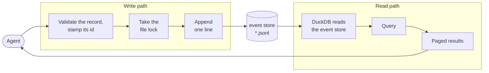

# The core module

The Python package that is the Brain's low-level interface to its data, and the first thing built. It defines the shape of a record and the layout of the folders, and it holds the write path. The MCP server imports it and wraps it; tests exercise it directly, with no server.

A Brain is an append-only log of events: it holds events, never current state, and how things stand now is worked out by reading the events in order. Every entry is appended through this module, so capture and corrections both depend on it: a record is never edited, and a correction is a new entry.

This item builds the write path. The read path in the diagram is [reading](reading.md), which extends this package later, so it is laid out for reading from the start.

**Not ready to build.** How the event store is laid out across machines, and whether a record carries `writer` and `seq`, are not settled; see [Not settled](#not-settled).



## Settled

- **One package, with writing and reading in separate modules** and a shared module for the record's shape and the folders' layout. The write path never loads DuckDB. The read side depends on the file format alone, never on the writer's internals.
- **Only this module writes the files.** It validates each record against the fields below and stamps its id. A person or a model never edits a file by hand; an agent reaches the files only through the server, which calls this module.
- **Two folders are configured**: the event store for the records, and the documents store for filed documents.
- **Sessions on one machine take turns through an OS file lock.**
- **Files roll at 10,000 lines.** Files are numbered with six zero-padded digits from `000001.jsonl`. The highest-numbered file is open; every other file is sealed and never changes again, so a backup or a sync copies it once. When a file rolls carries no meaning for a reader.
- **Each record is one line of JSON** in UTF-8, ended by a newline, with its fields at the top level and no wrapping payload object.

```json
{"id":"0199a8c4-…","type":"journal","version":1,
 "recorded_at":"2026-09-28T23:14:32Z","event_date":"2026-09-14",
 "description":"Oil change","source":"voice",
 "body":"## Service\nOil and filter changed…"}
```

Every field is required unless marked optional.

| Field | Carries |
| --- | --- |
| `id` | A UUIDv7. Unique everywhere without coordination. It carries no meaning a query relies on. |
| `type` | The kind of entry, such as `journal`. Every record is an entry; `type` says which kind. |
| `version` | The version of that type's shape the record was written under. |
| `recorded_at` | When it was written down, UTC. For display; nothing orders by it for correctness. |
| `event_date` | When the event happened, local date. What a reader orders by. |
| `description` | One-line summary. |
| `body` | Markdown: the account itself, and everything else the record holds. |
| `source` | How the information arrived, free text, such as `voice` or `email`. Optional. |

- **A record is never edited.**
- **An append is one whole line.** A writer that finds its open file ending without a newline, from a crash mid-append, ends that fragment with a newline before appending. It never truncates.

## Not settled

These are the current ideas, recorded so they are not lost. None is decided, and the item waits on them.

### A folder per machine

The problem is real: the event store is kept in step by a sync service such as Google Drive or Dropbox, and two machines appending to the same file at the same time leave the sync service holding conflicting copies.

The current idea answers it with one stream per machine install, each in its own folder under `events/`, so no two machines ever append to the same file; [the decision](../decisions/one-writer-stream-per-machine.md) records it. The objection is that it makes machines a permanent part of the Brain's layout, which is not wanted. What is wanted is a layout that avoids conflicting copies without that.

As the idea stands:

- **The writer id is the machine name plus a random suffix**, lowercase kebab-case, such as `desktop-7f3a9c`, generated once and kept. A `writer.json` in the writer's folder records the machine name it was created on and the software version; if that names a different machine, the data was copied, so a fresh writer id is generated.

```
<event store>/
  events/
    desktop-7f3a9c/
      writer.json
      000001.jsonl           sealed
      000002.jsonl           open, the only file this writer appends to
    laptop-c91e02/
      writer.json
      000001.jsonl

<documents store>/           filed documents
```

### `writer` and `seq` on the record

They may not need to be on the record at all, particularly with `id` a UUIDv7, which is unique without coordination and ordered by the time it was made. As the idea stands:

| Field | Carries |
| --- | --- |
| `writer` | The stream the record belongs to, repeated from the folder so a record stands alone wherever it is copied. |
| `seq` | The record's position in its writer's stream: one more than the writer's previous record, continuing across files and never reset. |

- **`seq` is taken from the writer's own last valid line, under the lock**, so a number is used only once its line is on disk.

What rests on them today, and would need another answer if they go:

- [Reading](reading.md) flags a duplicate `(writer, seq)` and reports a gap in a writer's `seq`.
- A snapshot's `read_upto` marks the last `seq` it read in each writer's stream. [That decision](../decisions/sequence-watermark-for-snapshots.md) rejected a time as the watermark because a record that arrives late by sync would sort before the mark and be skipped; a UUIDv7 is made from a time, so it meets the same objection.

### Smaller questions

- Whether Google Drive for Desktop holds a file open while uploading, which would make an append retry, and whether it writes a downloaded file in place or replaces it whole, which decides what a reader sees mid-download. A script appending every 100 ms while a second machine reads the synced copy settles both.
- Where the lock file lives. Inside the synced folders, the sync service uploads it and may hold it open; the lock only coordinates sessions on one machine, so it could live outside them.
- If there are writer ids, where a machine keeps its own: found by the `writer.json` that names this machine, or kept locally and checked against `writer.json`.

## Done when

- Concurrent sessions on one machine each append whole lines, and no two lines interleave.
- A file whose last line is torn gets that line ended with a newline before the next append.
- A file that passes the roll size is sealed and the next numbered file opens.
- A record missing a required field, or setting one the module stamps, is rejected.
- The tests drive the module directly, with no server.
- The record's shape and the folders' layout sit in the shared module, where the read side can import them.
- What the settled answers to the questions above require of the write path is built and tested.
