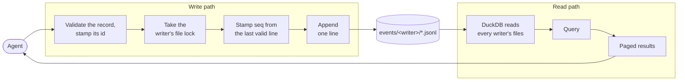

# The log

The write path. A Brain is an append-only log of events: it holds events, never current state, and how things stand now is worked out by reading the events in order. Every entry is appended here, so capture and corrections both depend on it: a record is never edited, and a correction is a new entry naming the old one.



## Settled

- **Only the server writes the files.** It validates each record and stamps its id and sequence number. A person or a model never edits a file by hand. The write path never loads DuckDB.
- **Two folders are configured**: the event store for the records, and the documents store for filed documents.
- **One writer per machine install.** Every session on a machine appends to that machine's stream, taking turns through an OS file lock. No two machines ever append to the same file; [the decision](../decisions/one-writer-stream-per-machine.md) says why.
- **The writer id is the machine name plus a random suffix**, lowercase kebab-case, such as `desktop-7f3a9c`, generated once and kept. A `writer.json` in the writer's folder records the machine name it was created on and the software version; if that names a different machine, the data was copied, so a fresh writer id is generated.
- **Files roll at 10,000 lines.** Files are numbered with six zero-padded digits from `000001.jsonl`. The highest-numbered file is open; every other file is sealed and never changes again, so a backup or a sync copies it once. When a file rolls carries no meaning for a reader.

```
<event store>/
  events/
    desktop-7f3a9c/
      writer.json
      000001.jsonl           sealed
      000002.jsonl           open, the only file this writer appends to
    laptop-c91e02/
      writer.json
      000001.jsonl

<documents store>/           filed documents, at the paths file references name
```

- **Each record is one line of JSON** in UTF-8, ended by a newline: reserved envelope keys beside the type's properties at the top level, with no wrapping payload object.

```json
{"id":"0199a8c4-…","type":"journal-entry","v":1,"writer":"desktop-7f3a9c","seq":4127,
 "recorded_at":"2026-09-28T23:14:32Z",
 "date":"2026-09-14","description":"Oil change","source":"voice",
 "entities":["family-car"],
 "references":[{"kind":"file","path":"vehicles/family-car/2026-09-14-invoice.pdf","sha256":"…"}],
 "body":"## Service\nOil and filter changed…"}
```

| Field | Carries |
| --- | --- |
| `id` | A UUIDv7. Unique everywhere without coordination, and what every reference names. It carries no meaning a query relies on. |
| `type`, `v` | The type the record is an instance of, and the version of that type's definition it was written under. |
| `writer` | The stream the record belongs to, repeated from the folder so a record stands alone wherever it is copied. |
| `seq` | The record's position in its writer's stream: one more than the writer's previous record, continuing across files and never reset. |
| `recorded_at` | When it was written down, UTC. For display; nothing orders by it for correctness. |
| `date` | When the event happened, local date. What a reader orders by. |
| `description` | One-line summary. |
| `body` | Markdown, the account itself. |
| `entities` | Slugs of the durable things the entry is about. |
| `references` | Files the entry rests on. |
| `amends` | The id of an earlier entry this one corrects or extends. Omitted when none. |
| `source` | How the information arrived, free text, such as `voice` or `email`. Optional. |

- **A record is never edited.** A correction is a new entry naming the old one in `amends`, and the newer one wins.
- **An append is one whole line.** A writer that finds its open file ending without a newline, from a crash mid-append, ends that fragment with a newline before appending. It never truncates.
- **`seq` is taken from the writer's own last valid line, under the lock**, so a number is used only once its line is on disk.

## Done when

- Concurrent writers on one machine each append whole lines, and no `seq` repeats.
- A stream whose last line is torn gets that line ended with a newline before the next append, and the next `seq` follows the last valid line.
- A file that passes the roll size is sealed, the next numbered file opens, and `seq` carries on across the two.
- A writer id is generated once and reused; one whose `writer.json` names a different machine is replaced with a fresh one.

## Open question

Whether Google Drive for Desktop holds a file open while uploading, which would make an append retry, and whether it writes a downloaded file in place or replaces it whole, which decides what a reader sees mid-download. A script appending every 100 ms while a second machine reads the synced copy settles both.
